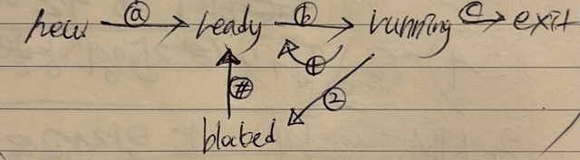

# process states; A five state model

[5-states process model; 프로세스 상태 변화도]

&nbsp; **new**
  &nbsp; : process에게 메모리가 할당될 때 
  &nbsp; &nbsp; 즉, 프로그램 "실행" 준비 단계

*a. admit*

&nbsp; **ready**
  &nbsp; : process에게 *processor*만 주어지면 언제든 실행 가능 
  &nbsp; &nbsp; 즉, 프로그램 **실행 가능**한 준비된 상태

*b. dispatch*

&nbsp; **running**
  &nbsp; : process가 *processor*에 의해 현재 실행 중일 때 
  &nbsp; &nbsp; 즉, 프로그램 **실행 중**인 상태

*c. release*
  &nbsp; *1. time out* (running to ready)
  &nbsp; *2. event wait* (I/O함수 호출 시, running to blocked)
  &nbsp; *#. event occur* (I/O 인터럽트 발생 시, blocked to ready)

&nbsp; **block**
  &nbsp; : process가 *processor*에 의해 I/O 장치에서 실행 대기 상태
  &nbsp; &nbsp; 즉, 프로그램 **실행 대기** 상태

&nbsp; **exit**
  &nbsp; : process가 *processor*에 의해 실행이 완료되어 폐기 
  &nbsp; &nbsp; 즉, 프로그램 **실행 종료**인 상태